# Entity-Relationship Diagram

Generated from `src/builder/schema.sql` (30 tables, the static schema
that's always present), plus the tables/columns `builder::community` adds
at runtime rather than declaring statically (see the note below the
diagram). Attribute lists are trimmed to primary/foreign keys plus one
identifying name field per table, for readability — see `schema.sql`
and `builder/community.rs` for the full column list, types, and
constraints.

`npcStations`/`stationOperations`/`stationServices` (plus their two
junction tables) replace the old `staStation`/`staCorporations`, which
were declared in the schema but never populated by any version of this
project, Rust or Python — verified against real SDE exports
(`npcStations.jsonl`, `stationOperations.jsonl`,
`stationServices.jsonl`), not a rename of the old design.

`npcCorporations` (6 → 27 columns) and `factions` (6 → 12 columns) were
similarly expanded against real data (`npcCorporations.jsonl`,
`npcCorporationDivisions.jsonl`, `factions.jsonl`) -- the original
versions captured only a small subset of what the real SDE actually
provides. `npcCorporations.enemyId`/`friendId`/`stationId`/`factionId`/
`solarSystemId`, `npcCorporationInvestors.investorId`, and
`factions.solarSystemId` are `DEFERRABLE` in the real schema (not shown
in this diagram's simplified relationship notation): several reference
tables that are only populated in later parsing phases, or reference
`npcCorporations` itself.

```mermaid
erDiagram
    invCategories {
        int categoryId PK
        string categoryName
    }
    invGroups {
        int groupId PK
        string groupName
        int categoryId FK
    }
    invTypes {
        int typeId PK
        string typeName
        int groupId FK
    }
    races {
        int raceId PK
        string raceName
    }
    npcCorporations {
        int corporationId PK
        string corporationName
        int raceId FK
        int enemyId FK
        int friendId FK
        int factionId FK
        int solarSystemId FK
        int stationId FK
    }
    npcCorporationDivisions {
        int divisionId PK
        string internalName
    }
    npcCorporationAllowedRaces {
        int corporationId PK, FK
        int raceId PK, FK
    }
    npcCorporationDivisionAssignments {
        int corporationId PK, FK
        int divisionId PK, FK
    }
    npcCorporationTrades {
        int corporationId PK, FK
        int typeId PK, FK
    }
    npcCorporationInvestors {
        int corporationId PK, FK
        int investorId PK, FK
    }
    factions {
        int factionId PK
        string factionName
        int corporationId FK
        int militiaCorporationId FK
        int solarSystemId FK
    }
    factionRace {
        int factionId PK, FK
        int raceId PK, FK
    }
    mapRegions {
        int regionId PK
        string regionName
        int factionId FK
    }
    mapConstellations {
        int constellationId PK
        string constellationName
        int regionId FK
    }
    mapSolarSystems {
        int solarSystemId PK
        string solarSystemName
        int constellationId FK
        int iceBelt
        int trigStatusID FK
        int joveObservatory
        int specialOreAnom
        int factionId FK
    }
    mapSolarSystemDisallowedAnchorableCategories {
        int solarSystemId PK, FK
        int categoryId PK, FK
    }
    mapSolarSystemDisallowedAnchorableGroups {
        int solarSystemId PK, FK
        int groupId PK, FK
    }
    mapSolarSystemSubType {
        int solarSystemId PK, FK
        string subType PK
    }
    factionSolarSystem {
        int solarSystemId PK, FK
        int factionId PK, FK
    }
    mapSystemGates {
        int systemGateId PK
        int solarSystemId PK, FK
        int destinationGateId FK
        int destinationSystemId FK
        int typeId FK
    }
    mapSystemConnections {
        int systemA PK, FK
        int systemB PK, FK
    }
    mapPlanets {
        int planetId PK
        int solarSystemId FK
        int typeId FK
    }
    typeStar {
        int starTypeId PK
        int typeId FK
        string name
    }
    mapStars {
        int starId PK
        int solarSystemId FK
        int starTypeId FK
    }
    mapMoons {
        int moonId
        int solarSystemId PK, FK
        int planetId FK
        int typeId FK
    }
    npcStations {
        int stationId PK
        int operationId FK
        int orbitMoonId FK
        int orbitPlanetId FK
        int ownerId FK
        int solarSystemId FK
        int typeId FK
    }
    stationOperations {
        int operationId PK
        string operationName
    }
    stationServices {
        int serviceId PK
        string serviceName
    }
    stationOperationServices {
        int operationId PK, FK
        int serviceId PK, FK
    }
    stationOperationTypes {
        int operationId PK, FK
        int sizeKey PK
        int typeId FK
    }

    %% -- Everything below this line is dynamic DDL, added at runtime by
    %% -- builder::community (not part of schema.sql) -- see the note below.
    mapAbstractSystems {
        int solarSystemId PK, FK
        int regionId PK, FK
    }
    mapTriglavianStatus {
        int trigStatusId PK
        string trigStatusName
    }

    invCategories ||--|{ invGroups : ""
    invGroups ||--o{ invTypes : ""
    races ||--o{ npcCorporations : ""
    npcCorporations ||--o{ factions : "corporationId"
    factions ||--|{ factionRace : ""
    races ||--|{ factionRace : ""
    factions ||--o{ mapRegions : ""
    mapRegions ||--|{ mapConstellations : ""
    mapConstellations ||--o{ mapSolarSystems : ""
    mapSolarSystems ||--|{ factionSolarSystem : ""
    mapSolarSystems ||--|{ mapSolarSystemDisallowedAnchorableCategories : ""
    invCategories ||--|{ mapSolarSystemDisallowedAnchorableCategories : ""
    mapSolarSystems ||--|{ mapSolarSystemDisallowedAnchorableGroups : ""
    invGroups ||--|{ mapSolarSystemDisallowedAnchorableGroups : ""
    mapSolarSystems ||--|{ mapSolarSystemSubType : ""
    factions ||--|{ factionSolarSystem : ""
    mapSolarSystems ||--|{ mapSystemGates : "origin"
    mapSolarSystems ||--|{ mapSystemGates : "destination"
    mapSystemGates ||--|{ mapSystemGates : "leads to"
    invTypes ||--|{ mapSystemGates : ""
    mapSolarSystems ||--|{ mapSystemConnections : "systemA"
    mapSolarSystems ||--|{ mapSystemConnections : "systemB"
    mapSolarSystems ||--o{ mapPlanets : ""
    invTypes ||--|{ mapPlanets : ""
    invTypes ||--|{ typeStar : ""
    mapSolarSystems ||--o{ mapStars : ""
    typeStar ||--|{ mapStars : ""
    mapSolarSystems ||--o{ mapMoons : ""
    mapPlanets ||--o{ mapMoons : ""
    invTypes ||--o{ mapMoons : ""
    mapSolarSystems ||--|{ npcStations : ""
    stationOperations ||--|{ npcStations : ""
    mapMoons ||--o{ npcStations : "orbitMoonId"
    mapPlanets ||--o{ npcStations : "orbitPlanetId"
    npcCorporations ||--|{ npcStations : "ownerId"
    npcCorporations ||--o{ npcCorporations : "enemyId"
    npcCorporations ||--o{ npcCorporations : "friendId"
    factions ||--o{ npcCorporations : "factionId"
    mapSolarSystems ||--o{ npcCorporations : ""
    npcStations ||--o{ npcCorporations : "stationId"
    npcCorporations ||--o{ factions : "militiaCorporationId"
    mapSolarSystems ||--o{ factions : ""
    factions ||--o{ mapSolarSystems : "factionId"
    npcCorporations ||--|{ npcCorporationAllowedRaces : ""
    races ||--|{ npcCorporationAllowedRaces : ""
    npcCorporations ||--|{ npcCorporationDivisionAssignments : ""
    npcCorporationDivisions ||--|{ npcCorporationDivisionAssignments : ""
    npcCorporations ||--|{ npcCorporationTrades : ""
    invTypes ||--|{ npcCorporationTrades : ""
    npcCorporations ||--|{ npcCorporationInvestors : "corporationId"
    npcCorporations ||--|{ npcCorporationInvestors : "investorId"
    invTypes ||--|{ npcStations : ""
    stationOperations ||--|{ stationOperationServices : ""
    stationServices ||--|{ stationOperationServices : ""
    stationOperations ||--|{ stationOperationTypes : ""
    invTypes ||--|{ stationOperationTypes : ""
    mapSolarSystems ||--|{ mapAbstractSystems : ""
    mapRegions ||--|{ mapAbstractSystems : ""
    mapTriglavianStatus ||--o{ mapSolarSystems : ""
```

## Reading the diagram

- `||--|{` — the referenced row is required (`NOT NULL` foreign key).
- `||--o{` — the reference is optional (nullable foreign key).
- `factionRace`, `factionSolarSystem`, `stationOperationServices`,
  `npcCorporationAllowedRaces`, `npcCorporationDivisionAssignments`,
  `npcCorporationTrades`, `npcCorporationInvestors`,
  `mapSolarSystemDisallowedAnchorableCategories`,
  `mapSolarSystemDisallowedAnchorableGroups`, and
  `mapSolarSystemSubType` are pure join tables
  (composite primary key, no columns of their own).
  `stationOperationTypes` is almost the same, plus a plain `sizeKey`
  integer that isn't itself a foreign key.
- `mapSystemGates` has two separate foreign keys into
  `mapSolarSystems` (`solarSystemId`, `destinationSystemId`) plus a
  self-reference (`destinationGateId`, the paired gate on the other
  end of the connection) — shown as three separate relationship lines.
- `mapSystemConnections` likewise has two foreign keys into
  `mapSolarSystems` (`systemA`, `systemB`).

### Static vs. dynamic

Everything above the `%%` comment inside the diagram comes from
`schema.sql` and is always present. `mapAbstractSystems`,
`mapTriglavianStatus`, and the four extra `mapSolarSystems` columns
(`iceBelt`, `trigStatusID`, `joveObservatory`, `specialOreAnom`) are
different: they don't exist in `schema.sql` at all. `builder::community`
adds each of them at runtime (`CREATE TABLE`/`ALTER TABLE`), and this
whole layer is opt-in: none of it runs at all unless
`ParserConfig.with_third_party` is set (`sde-builder build
--with-third-party`), off by default -- a plain build produces a
database containing canonical SDE data only, since none of this comes
from CCP's official export. When it does run, `mapAbstractSystems` is
added unconditionally (no sub-flag of its own beyond
`with_third_party`); the other four are each gated by their own
`CommunityConfig` flag on top of that -- a database built with a given
flag off simply doesn't have that table/column, rather than having it
sit there empty. This -- plus the `with_third_party` gate -- is why
they're kept out of the static schema in the first place: this data
comes from outside CCP's official SDE, and folding it into the
canonical schema would blur that line.

| Addition | Added when `with_third_party` is on? |
|---|---|
| `mapAbstractSystems` | Always |
| `iceBelt` (on `mapSolarSystems`) | Only if `with_icebelts` |
| `mapTriglavianStatus` + `trigStatusID` | Only if `with_triglavian_status` |
| `joveObservatory` (on `mapSolarSystems`) | Only if `with_jove_observatories` |
| `specialOreAnom` (on `mapSolarSystems`) | Only if `with_special_ore` |
